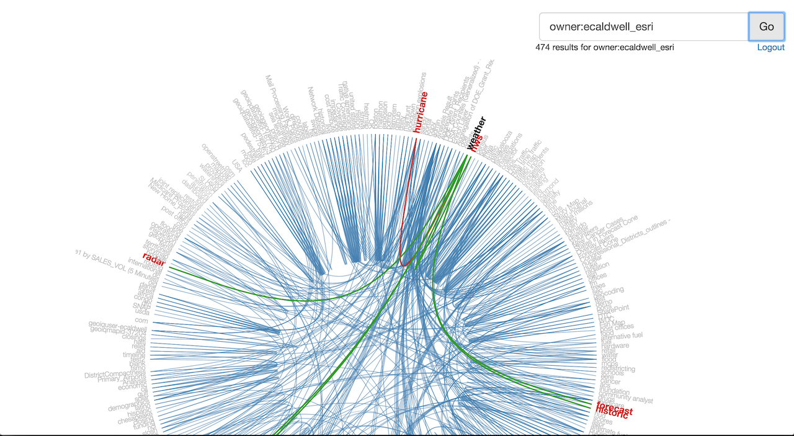

# d3-tag-viz

This app uses the [ArcGIS REST API](http://www.arcgis.com/apidocs/rest/) and [D3](http://d3js.org/) to visualize the relationships between tagged items in ArcGIS Online or Portal for ArcGIS. 

The idea for this app is based on [this example](http://bl.ocks.org/mbostock/7607999) from Mike Bostock.

## Requirements

* Notepad or your favorite HTML editor
* Web browser with access to the Internet

## Issues

Find a bug or want to request a new feature?  Please let us know by submitting an issue.

## Contributing

Anyone and everyone is welcome to contribute.

## Licensing

Licensed under the Apache License, Version 2.0 (the "License");
you may not use this file except in compliance with the License.
You may obtain a copy of the License at

   http://www.apache.org/licenses/LICENSE-2.0

Unless required by applicable law or agreed to in writing, software
distributed under the License is distributed on an "AS IS" BASIS,
WITHOUT WARRANTIES OR CONDITIONS OF ANY KIND, either express or implied.
See the License for the specific language governing permissions and
limitations under the License.